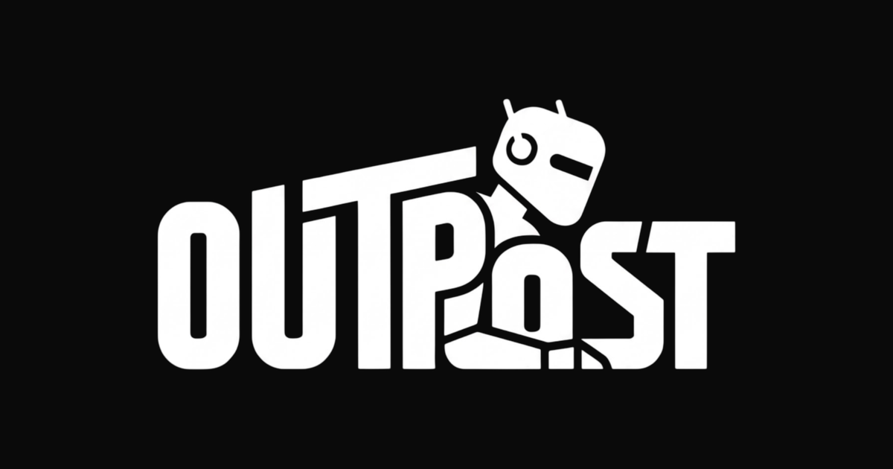

<div align="center">



# Outpost

**An agentic workspace: chat with an AI agent that draws on a canvas and writes docs, while your team works alongside it in real time.**

Built step by step in a YouTube tutorial on the **roadsidecoder** channel.<br />
▶ **Watch the tutorial:** _link coming soon_

</div>

> [!NOTE]
> Outpost is **tutorial code**, built to teach how an agentic app works end to end. It runs well and is a solid starting point, but it takes a few deliberate shortcuts to keep the video focused. See [Tutorial shortcuts](#tutorial-shortcuts) before using it in production.

## What you'll build

- **An AI agent that works on two surfaces.** Ask for "a database schema, documented" and it draws the ERD on the canvas and writes the spec in the doc. Name a surface ("just the doc") and it sticks to it.
- **A tldraw canvas** with a custom ERD table shape: editable columns, primary and foreign key badges, and arrows that snap to rows.
- **A block-based doc** (BlockNote) with real-time collaboration: live cursors and edits merged with Yjs over Supabase Realtime.
- **Real-time canvas collaboration** with live cursors, via tldraw sync.
- **Teams with Clerk Organizations:** everyone in an org can open any of its workspaces.
- **A dashboard** where you describe what you want to plan (typed or by voice) and land in a new workspace with the agent already working.
- **A kanban board** of workspaces with drag and drop.
- **Sharing:** public read-only links, plus PDF export of the doc and canvas.
- **Subscriptions with Clerk Billing:** per-seat team plans, usage tracking and plan limits.

## Tech stack

| Area                   | Choice                                                                         |
| ---------------------- | ------------------------------------------------------------------------------ |
| Framework              | [Next.js](https://nextjs.org) (App Router, Server Actions)                     |
| Auth, orgs and billing | [Clerk](https://clerk.com) (Organizations and Clerk Billing)                   |
| Database and realtime  | [Supabase](https://supabase.com) (Postgres and Realtime)                       |
| ORM                    | [Prisma](https://www.prisma.io)                                                |
| AI                     | [Vercel AI SDK](https://ai-sdk.dev) with Google Gemini                         |
| Canvas                 | [tldraw](https://tldraw.dev) and tldraw sync                                   |
| Docs                   | [BlockNote](https://www.blocknotejs.org) and [Yjs](https://yjs.dev)            |
| UI                     | [Tailwind CSS](https://tailwindcss.com) and [shadcn/ui](https://ui.shadcn.com) |

## Getting started

### Prerequisites

- Node.js 22 or later
- Free accounts on [Clerk](https://clerk.com), [Supabase](https://supabase.com) and [Google AI Studio](https://aistudio.google.com)

### 1. Install

```bash
git clone <this-repo-url> outpost
cd outpost
npm install
```

`npm install` also generates the Prisma client.

### 2. Environment variables

```bash
cp .env.example .env
```

Fill in `.env`. Each variable has a comment saying where to find it.

| Variable                                                           | Where it comes from                                                                           |
| ------------------------------------------------------------------ | --------------------------------------------------------------------------------------------- |
| `NEXT_PUBLIC_CLERK_PUBLISHABLE_KEY`, `CLERK_SECRET_KEY`            | Clerk dashboard → API keys                                                                    |
| `DATABASE_URL`                                                     | Supabase → Connect: the **pooled** connection string (port 6543), with `?pgbouncer=true`      |
| `DIRECT_URL`                                                       | Supabase → Connect: the **direct/session** connection string (port 5432), used for migrations |
| `NEXT_PUBLIC_SUPABASE_URL`, `NEXT_PUBLIC_SUPABASE_PUBLISHABLE_KEY` | Supabase → Project Settings → API                                                             |
| `GOOGLE_GENERATIVE_AI_API_KEY`                                     | Google AI Studio → API keys                                                                   |
| `NEXT_PUBLIC_TLDRAW_LICENSE_KEY`                                   | Optional in development (see [Deploying](#deploying))                                         |

### 3. Database

Create the tables in your Supabase database:

```bash
npx prisma migrate deploy
```

### 4. Clerk setup

In the [Clerk dashboard](https://dashboard.clerk.com):

1. **Organizations:** enable them, with **Membership optional**, so people can also work in a personal account.
2. **Billing:** enable billing for **users** and **organizations**, and choose the **Clerk development gateway** (test payments, no Stripe account needed).
3. **Features** (Billing → Subscription plans → Features). The code checks these keys, so use them exactly:

   | Key                    | Purpose                                |
   | ---------------------- | -------------------------------------- |
   | `unlimited_workspaces` | Removes the 3-workspace limit          |
   | `public_sharing`       | Public read-only links                 |
   | `pdf_export`           | PDF export                             |
   | `agent_prompts_500`    | 500 agent prompts per seat per month   |
   | `agent_prompts_2000`   | 2,000 agent prompts per seat per month |

   You can add display-only features too (like "Voice input"). The code ignores keys it doesn't know. Never attach the five keys above to a Free plan.

4. **Plans** (monthly):

   | Plan       | Type                     | Key          | Price                  | Features                                   |
   | ---------- | ------------------------ | ------------ | ---------------------- | ------------------------------------------ |
   | Free       | user and org (default)   |              | $0                     | none of the five above                     |
   | Pro        | user                     | `pro`        | $12 / month            | the first four                             |
   | Team       | organization, seat-based | `team`       | $12 per member / month | the first four                             |
   | Enterprise | organization, seat-based | `enterprise` | $25 per member / month | the first three, plus `agent_prompts_2000` |

Free plans are limited to 20 agent prompts a month and 3 workspaces. These numbers live in `lib/plan-limits.ts`.

### 5. Supabase Realtime

Doc collaboration uses **public** Realtime broadcast channels. In your Supabase project's Realtime settings, make sure public (non-private) channels are allowed.

### 6. Run

```bash
npm run dev
```

Open [http://localhost:3000](http://localhost:3000). To try collaboration, sign in with two different accounts in two browser windows (for example a normal and a private window).

## Project structure

```
app/
  page.tsx                  Landing page
  (main)/dashboard/         Prompt box and recent workspaces
  (main)/workspaces/        Kanban board of all workspaces
  (main)/workspace/[id]/    The workspace: doc, canvas and agent
  shared/[token]/           Public read-only view
  pricing/                  Pricing page
  api/agent/                The agent: Gemini, tools and prompt limits
actions/                    Server Actions (workspaces, docs, canvas, usage)
components/                 UI, including the doc and canvas editors
  EntityTable/              The custom ERD table shape for tldraw
hooks/                      Agent chat, collaborative doc and more
lib/
  agent-tools.ts            Every agent tool's description and schema
  agent-canvas.ts           Canvas tools, run in the browser
  agent-doc.ts              Doc tools, run in the browser
  billing.ts                Plan lookup from Clerk and prompt usage
  plan-limits.ts            Free limits and upgrade messages
  supabase-yjs-provider.ts  Syncs the doc over Supabase Realtime
prisma/                     Database schema and migrations
```

**How the agent works:** the agent's tools have no server-side implementation. Gemini decides which tool to call, and the browser runs it against the live canvas and doc editors, so collaborators see changes appear in real time. Every request sends a compact summary of both surfaces, so the agent can edit what's already there.

## Tutorial shortcuts

These are deliberate simplifications. Each one has a straightforward production upgrade:

| Shortcut                                                                                                                                                                              | What to do for production                                                                                                                                               |
| ------------------------------------------------------------------------------------------------------------------------------------------------------------------------------------- | ----------------------------------------------------------------------------------------------------------------------------------------------------------------------- |
| The canvas syncs through **tldraw's hosted demo server** (`useSyncDemo`): public rooms, data may be wiped, and no uptime guarantee. The canvas is also saved to Postgres as a backup. | Deploy your own sync server from tldraw's template (`npm create tldraw@latest -- --template sync-cloudflare`) and switch to `useSync` in `components/CanvasEditor.tsx`. |
| Doc collaboration uses **public** Supabase Realtime channels.                                                                                                                         | Use private channels with Supabase Realtime Authorization, and connect Clerk to Supabase so clients join with their Clerk session.                                      |
| **PDF export** is only locked in the UI, since it runs in the browser.                                                                                                                | Fine for most apps. Move export to the server if it must be strictly enforced.                                                                                          |
| Billing uses Clerk's **development gateway**.                                                                                                                                         | Connect your own Stripe account in Clerk before taking real payments.                                                                                                   |
| Clerk Billing is in public beta, and its components are **experimental**.                                                                                                             | `@clerk/nextjs` and `@clerk/ui` are pinned to exact versions. Keep them pinned, and test before upgrading.                                                              |

## Deploying

1. Deploy to [Vercel](https://vercel.com) and add the same environment variables.
2. Get a free **hobby license** from [tldraw.dev](https://tldraw.dev/pricing) and set `NEXT_PUBLIC_TLDRAW_LICENSE_KEY`. Without a key, tldraw shows a "Get a license for production" watermark.
3. For real payments, connect Stripe in Clerk Billing.

## Scripts

| Command         | What it does               |
| --------------- | -------------------------- |
| `npm run dev`   | Start the dev server       |
| `npm run build` | Production build           |
| `npm run start` | Serve the production build |
| `npm run lint`  | Lint with ESLint           |

After changing `prisma/schema.prisma`, create and apply a migration, run `npx prisma generate`, and restart the dev server.

## License

[GPL-3.0](LICENSE). The PDF export uses BlockNote's [`@blocknote/xl-pdf-exporter`](https://www.blocknotejs.org/docs/features/export/pdf), which is GPL-3.0 licensed, so the whole project is too. You can use, change and share this code, including commercially, as long as your version stays open source under GPL-3.0. To use it in a closed-source product, remove the PDF exporter or get a [BlockNote commercial license](https://www.blocknotejs.org/pricing).
